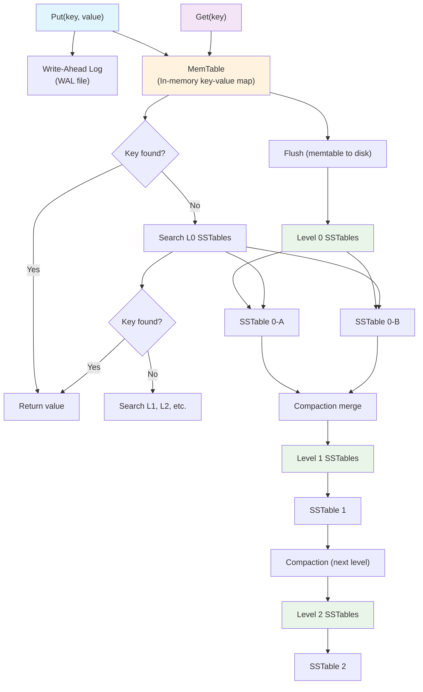

# mini-leveldb

An educational implementation of LevelDB in Go. Learn how LSM trees, compaction, and storage engines work by exploring a clean, well-structured codebase.

## What You'll Learn

- **LSM Tree Architecture**: Multi-level compaction from L0 to L6
- **Write-Ahead Logging**: Binary WAL with CRC32 integrity
- **Memory-Mapped I/O**: Zero-copy file access patterns
- **Bloom Filters**: Probabilistic data structures for fast lookups
- **Storage Engine Design**: From memtables to persistent storage
- **Performance Optimization**: Batch operations and efficient I/O

## Quick Start

```bash
# Build and try it out
make build

# Basic operations
./build/minildb put key1 value1
./build/minildb get key1
./build/minildb flush
```

## Architecture



## Code Structure

- `db/` - Core database implementation
  - `db.go` - Main DB interface with multi-level compaction
  - `sstable.go` - SSTable format with mmap and bloom filters  
  - `wal.go` - Write-ahead log with binary format
  - `bloom.go` - Bloom filter implementation
- `cmd/` - CLI interface

## Testing

```bash
make test
```

## Why mini-leveldb?

This project focuses on **clarity over performance**. Each component is implemented to be:
- **Readable**: Clean, well-structured Go code
- **Educational**: Learn database internals step by step  
- **Complete**: All major LevelDB features included
- **Testable**: Comprehensive test coverage

Perfect for understanding how modern storage engines like RocksDB, TiKV, and CockroachDB work under the hood.

## License

MIT License
